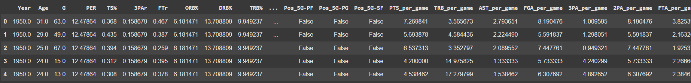
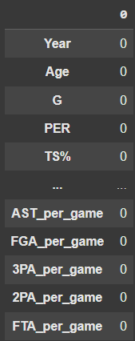
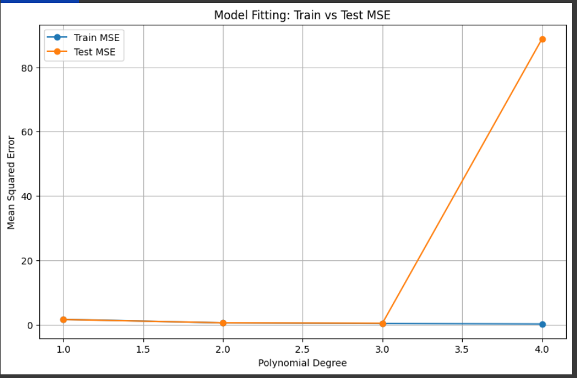
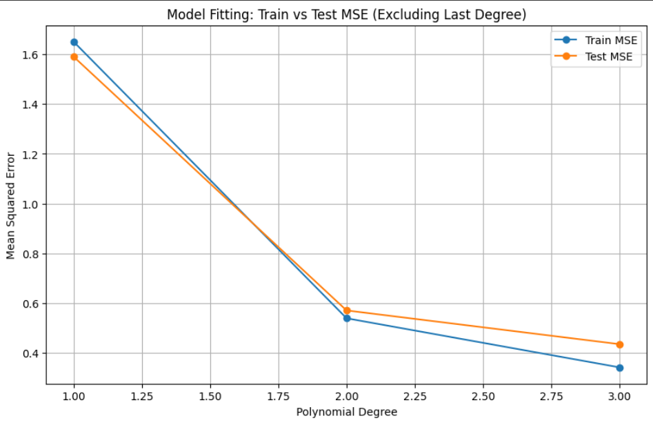

# 1. Introduction
## Predicting Points Per Game (PPG) Using NBA Performance Metrics

Our project focuses on developing a supervised learning model designed to predict the **Points Per Game (PPG)** statistic in the NBA based on a range of other tracked performance metrics. By making use of a **polynomial regression model**, we analyzed the following features:

#### Per-Game Stats:
- Total Rebounds (TRB)
- Assists (AST)
- Minutes Played (MP)
- Field Goals Attempted (FGA)
- Three-Point Attempts (3PA)
- Two-Point Attempts (2PA)
- Free Throws Attempted (FTA)

#### Advanced Metrics:
- Win Shares (WS)
- Box Plus-Minus (BPM)
- Player Efficiency Rating (PER)
- Value Over Replacement Player (VORP)
- Offensive Box Plus-Minus (OBPM)
- Offensive Win Shares (OWS)

The [dataset](path/to/your/dataset.csv) we used contained information collected from the 1950s on **24,000 NBA player seasons**, providing a good sample size to shape our model to.

## Key Insights
This model aims to predict PPG by incorporating features that are less prone to early-season/bad shooting stretch variance which. It can account for temporary slumps (e.g., in shooting efficiency) and project a player's **overall scoring trajectory** for the season with greater stability.

## Real-World Applications
- **Betting Predictions:** Accurate PPG forecasts can inform predictive models for betting markets, enhancing decision-making in wagering scenarios.
- **Performance Evaluation:** NBA analysts and teams could use this tool to estimate a player's potential for accolades like **Most Valuable Player (MVP)** considering the importance of scoring in such an award.


# 2. Figures

# 3. Methods
## Data Exploration and Results
Main data exploration tools used were from numPy and Pandas libraries.
- **Importing our data:** our data came in the form of an csv. We stored the file in our GitHub Repository and read it using:
  
 ```nbadf = pd.read_csv('CSE151AGroupProject/Seasons_Stats.csv')```

 - **Understanding Our Data**  
   - **Getting a baseline:** we executed several lines of code in order to understand our data better
     - **Discovering features**  ```nbadf.dtypes```
     - **Looking into our Categorical Features**: 
       - ```#for positions print(nbadf.Pos.unique())```
     - **Accessing Distribution:** ```nbadf.describe()```
     - **Counting Mean:** ```nbadf.isnull().sum()```

We performed our exploratory data analysis and obtained the following results
**3.1 Team Distribution**

- Largest pool: 'TOT' (>2000 players)
- Second largest: 'NYK' (~1050 players)
- Third largest: 'BOS' (~1000 players)

**3.2 Visualization of relationship between each player feature**

  At a glance, we can see that Points (`PTS`) are generally normally distributed. We also observe a linear relationship between Points (`PTS`) and Field Goals Attempted (`FGA`), and Points (`PTS`) and Free Throws Attempted (`FTA`).
  
**3.3 Correlation between each player feature**

  The strongest correlations were between: Field Goals Attempted (`FGA`) and Points (`PTS`) at 0.99, followed by Minutes Played (`MP`) and Points (`PTS`), and Minutes Played (`MP`) and Field Goals Attempted (`FGA`) at 0.93.

**3.4 Missing Data**

  We notice that `blanl` and `blank2` have the most missing values of greater than 20,000. There were also significant missing values in the Percentage of 3-Point Field Goal Percentage (`3P%`) of more than 9,000, followed by 3-Point Field Goals Attempted (`3PAr`), Games Started (`GS`), Team's Turnovers (`TOV`) and Usage Rate (`USG`) at about 5,000 data points each.


     
## Preproccessing

### Steps Included:

1. **Removing Unwanted/Invalid Features:**
   - Removed features containing unusable data: `Unnamed: 0`, `blanl`, `blank2`.
   - Excluded features deemed unnecessary: `GS`, `Player`.
   - Dropped features that would not generalize well or were too constricting for predictions: `ORB`, `DRB`, `3P`, `2P`, and `FG`,`.
   - See corresponding code in **Lines 2-3**.

2. **Imputing Null Data:**
   - Imputed missing values for numerical columns by:
     - Grouping by `Year` and filling with the mean for years close to each other.
     - Filling any remaining missing values using the global average.
   - Specifically computed and filled `MP_per_game` based on the ratio of average `MP` to `G`.
   - See corresponding code in **Lines 5-16 and Lines 18-22**.

3. **Removing Remaining NaNs:**
   - Dropped rows containing any remaining null values after imputation.
   - See corresponding code in **Line 24**.

4. **One-Hot Encoding Categorical Data:**
   - Applied one-hot encoding to categorical features: `Tm` (Team) and `Pos` (Position).
   - See corresponding code in **Line 26**.

5. **Feature Engineering: Filtering Features to Per Game Statistics:**
   - Converted raw features like `PTS`, `TRB`, `AST`, etc., into per-game statistics by dividing by the number of games (`G`).
   - Removed the original columns after computing the per-game values.
   - See corresponding code in **Lines 28-36**.

6. **Splitting and Normalization**-
   - Splitting our data into training and testing section with SKlearn train_test_split  
```python
from sklearn.model_selection import train_test_split

X_train, X_test, y_train, y_test = train_test_split(processed_nbadf[['Desired Features']], processed_nbadf.PTS_per_game, test_size=0.2, random_state=21)
```

  - Normalization of our data through sklearn MinMaxScaler
  ```python
from sklearn.preprocessing import MinMaxScaler,
scaler = MinMaxScaler()
X_train_scaled = scaler.fit_transform(X_train)
X_test_scaled = scaler.transform(X_test)

X_train = pd.DataFrame(X_train_scaled, columns=X_train.columns, index=X_train.index)
X_test = pd.DataFrame(X_test_scaled, columns=X_test.columns, index=X_test.index)
```

---
## Model 1
We started by implementing a simple LienarRegression from SKlearn implementation of LinearRegression using `TRB_per_game`, `AST_per_game`, `MP_per_game`, `3PA_per_game`, `2PA_per_game`, `FTA_per_game`,`Age`, and `OBPM`

```python
from sklearn.linear_model import LinearRegression
from sklearn.metrics import mean_squared_error
``` 
Creation of the model
```python
  linearreg = LinearRegression()
  linearmodel = linearreg.fit(X_train, y_train)
```

Testing MSE for our model
```python
yhat_test = linearreg.predict(X_test)
yhat_train = linearreg.predict(X_train)
testMSE = mean_squared_error(y_test, yhat_test)
trainMSe = mean_squared_error(y_train, yhat_train)
```
Our model was created and fit to our train data

## Model 2
Using the same processed data except for  features
`TRB_per_game`, `AST_per_game`, `MP_per_game`, `3PA_per_game`, `2PA_per_game`, `FTA_per_game`, `WS`, `BPM`, `PER`, `VORP`, and `Age`

Our second model Made use of Sklearn Polynomial Feature adder
```python
from sklearn.preprocessing import PolynomialFeatures
```
We needed to tune our degree parameter to be a correct fit for our model (choosing degree = 3)which was found using code below:
```python
degrees = [1,2,3,4]
for degree in degrees:
  initialDegree = degree
  poly = PolynomialFeatures(degree=initialDegree)
  X_train_poly = poly.fit_transform(X_train)
  X_test_poly = poly.transform(X_test)

  model2 = LinearRegression()
  model2.fit(X_train_poly, y_train)
  y_train_pred = model2.predict(X_train_poly)
  y_test_pred = model2.predict(X_test_poly)


  train_mse = mean_squared_error(y_train, y_train_pred)
  test_mse = mean_squared_error(y_test, y_test_pred)
  train_mse_list.append(train_mse)
  test_mse_list.append(test_mse)

  print(f"Polynomial Regression (Degree={initialDegree})")
  print(f"Train MSE: {train_mse:.2f}")
  print(f"Test MSE: {test_mse:.2f}")
  ```
Once our degree was found we simply created our model as such
```python 
poly = PolynomialFeatures(degree=3)
X_train_poly = poly.fit_transform(X_train)
X_test_poly = poly.transform(X_test)
model2 = LinearRegression()
model2.fit(X_train_poly, y_train)
y_test_pred = model2.predict(X_test_poly)
```

To see the accuracy of our models predictions we compared ŷ to y (`ppg`) to score differential between prediction and reality
``` python
newY = y_test - y_test_pred
# Define thresholds
thresholds = [0.5, 1, 2.5, 5]

# Calculate residuals
newY = y_test - y_test_pred

# Calculate FNFP (total values not within ±0.5)
correct = len(newY[abs(newY) < 0.5])
FNFP = len(y_test) - correct

# Count how many FNFP are within each threshold range
fnfp_within_ranges = [
    len(newY[(abs(newY) > thresholds[i]) & (abs(newY) <= thresholds[i + 1])])
    for i in range(len(thresholds) - 1)
]

# Print results
print(f"Correct Values: {correct}")
print(f"FNFP Values: {FNFP}")
for i in range(len(thresholds) - 1):
    print(f"FNFP between {thresholds[i]} and {thresholds[i+1]}: {fnfp_within_ranges[i]}")
```

To do more analysis on whether our model was overfitting/underfitting used SKlearn Cross validation score
```python
from sklearn.model_selection import cross_val_score
from sklearn.model_selection import KFold
kf = KFold(n_splits=10, shuffle=True)
cv_scores = cross_val_score(model2, X_train_poly, y_train, cv=kf, scoring='neg_mean_squared_error')
print('Cross-Validation Scores:', -cv_scores)
```


## Figures Code
- figure 1
 ```python
 columns = ['PTS', 'G', 'MP', 'FG%', 'FGA', 'FT%', 'FTA','BPM','WS','VORP']

# Create a PairGrid with 'PTS' as the y-axis for all other features
g = sns.PairGrid(nbadf, y_vars=['PTS'], x_vars=columns[1:])  # Exclude 'PTS' from x_vars
g.map(sns.scatterplot)  # Use scatter plots for visualization

# Adjust layout and display
g.fig.suptitle("Pairplot: PTS (y-axis) vs Other Features (x-axis)", y=1.02)
plt.show()
```

- figure 2
  
```python
corr = nbadf[['PTS', 'G', 'MP', 'FG%', 'FGA', 'FT%', 'FTA']].corr()
sns.heatmap(corr, vmin=-1, vmax=1, center=0, annot=True, cmap= 'RdBu')
```


- correlation matrix (Model 1 features)
```python
# Calculate the correlation matrix
corr = processed_nbadf[['PTS_per_game','TRB_per_game', 'AST_per_game', 'MP_per_game', '3PA_per_game', '2PA_per_game', 'FTA_per_game','WS','BPM', 'PER','VORP','OBPM','Age', 'FGA_per_game']].corr()
# Set up the figure size
plt.figure(figsize=(12, 8))  # Adjust the width (12) and height (8) as needed

# Plot the heatmap
sns.heatmap(corr, vmin=-1, vmax=1, center=0, annot=True, cmap='RdBu')
plt.title("Correlation Heatmap", fontsize=16)

# Show the plot
plt.show()
```
# 3. Results

## Data Exploration
From looking at the first 20 values of our data, we see 
early NBA didn't keep track of all stats like they do now. As such we needed to see how many null values we had


**Null Values**


Which gives us an idea of what we need to work on, and how we will tackle the null values

To get a basic relation of our target(`PPG`) and other features we did a simple plot against each other and found a couple of recognizable patterns(normal, linear)


<div style="text-align: center;">
<small><i>figure 1</i></small>
</div>

We also wanted a slight preview in the relationship as correlation between our features and our target variable
<div style="text-align: center;">
    
</div>
<div style="text-align: center;">
<small><i>figure 2 (correlation heatmap)</i></small>
</div>


## Data Preprocessing
After all prepocessing was finished, our new dataframe ends up looking like: 


Our null values have become zero as desired as well:




Check our X train and X test are normalized and sizes are looking right:
<div style="text-align: center;">
    
</div>
<div style="text-align: center;">
<small><i>XTestScaled</i></small>
</div>

<div style="text-align: center;">
    
</div>
<div style="text-align: center;">
<small><i>XTrainScaled</i></small>
</div>

<div style="text-align: center;">
    
</div>
<div style="text-align: center;">
  <small><i>X_train Shape (above)</i></small><br>
  <small><i>X_test Shape (Below)</i></small>
</div>

## Model 1
**Running Model 1**: 
- Our first output for our Linear regression model outputted as
```python
Training MSE: 0.52
Testing MSE: 0.50
```

To find out why MSE was so low we 

<div style="text-align: center;">
  <small><i>Correlation matrix of features</i></small>
</div>


Running Linear model without `FGA_per_game` results in 

 
```python
Training MSE for no FGA: 1.65
Testing MSE for no FGA: 1.59
```
 
 We then check for overfitting using Kfold Cross validation for first run of model
```python
Cross-Validation Scores: [0.46139252 0.48908755 0.5362284  0.48781997 0.54074659 0.49958713
 0.50085788 0.52959658 0.53930553 0.60954084]
```

## Model 2

After implementation of our second model we printed out the MSE between the training and testing as well as their differences against degree (complexity) 
```python
Polynomial Regression (Degree=1)
Train MSE: 1.65
Test MSE: 1.59
Polynomial Regression (Degree=2)
Train MSE: 0.54
Test MSE: 0.57
Polynomial Regression (Degree=3)
Train MSE: 0.34
Test MSE: 0.44
Polynomial Regression (Degree=4)
Train MSE: 0.21
Test MSE: 88.83
```


<div style="text-align: center;">
  <small><i>Fitting Graph all 4 degrees</i></small>
</div>


<div style="text-align: center;">
  <small><i>Fitting Graph 3 degrees</i></small>
</div>


Checking for overfitting based on KFold Cross Validation we got : 
``` python
Cross-Validation Scores (MSE): [ 0.43217879  0.46648901  0.43258806  0.57135784  0.39732678  0.51268138
  0.67144083 14.51494587  0.82262654  0.52637149]
```

### Checking Accuracy
By checking the point differential we concluded our model was able to predict
```python
Correct Values: 3408
FNFP Values: 1517
FNFP between 0.5 and 1: 1055
FNFP between 1 and 2.5: 432
FNFP between 2.5 and 5: 25
FNFP between 5 and 10: 5
```

Considering the range of point typically is between 6 to 27, 
we classified as followed:


- Between .5 and 1: marginally small/ignorable
- Between 1 and 2.5 as :meaningful error
- anything > 2.5 as critical

Definitively classifiable as Correct: Correct: 69.20%

Allowable Correctness : 90.62%

# 4. Discussion

## Data Exploration
**Important Observations**
- The 67 seasons missing for `Year`, `Player`,... etc. we reasoned to be droppable because they make up such a small percentage of the poplulation.
- Early on, (1st Milestone) we recognized that older data had to be imputed because certain stats were just not tracked.
- After plotting and seeing figure1, the vaguely linear relationships seen made us want to go with linear regression as our first model to test the grounds.
  

## Data Preprocessing  
**Rationale Behind Each Step**  

#### **Feature Removal**  
- **`Unnamed: 0`, `blanl`, `blank2`:** These columns were entirely null and provided no useful information, so they were removed to clean the dataset.  
- **`GS`, `Player`:**  
  - `Player`: We determined that the player's name would not serve as a reliable predictor for statistical performance, and one-hot encoding it would explode our dimension size.  
  - `GS`: This feature was redundant as it correlated closely with `MP` (minutes played). Starters who start games generally accumulate higher minutes, making `GS` unnecessary.  
- **`ORB`, `DRB`****: removed because together they make up `TRB`
-  **`3P`, `2P`, and `FG`:** These features were removed as they are direct contributors to the target variables (e.g., Points Per Game). Including them would risk introducing bias and redundancy in the model.  

#### **Handling Missing Data**  
- **Grouped Imputation by Year:** Missing values were imputed by grouping data based on the year to account for changes in statistical trends across different eras of basketball. This approach helped maintain the integrity of historical differences in player performances.  
  - **Challenge Noted:** Most missing data were clustered in earlier years, which may have introduced bias due to the lack of diverse data representation in those eras.  
- **Global Average for `MPG`:**  
  - The global average was used to impute missing values for `MPG` (Minutes Per Game). Unlike other per-game statistics, `MPG` had a significantly higher proportion of missing values. Filling these gaps using year-specific averages resulted in impossible values (e.g., minutes exceeding a game's total duration). Hence, the global average was deemed more reliable for consistency.
- **Ensure excluding NaN** This step was done to make sure we aren't getting any null values in our data, and we determined the loss of observations is negligble compared to the size of our dataset

## Model 1

#### **Results and Configuration of Model**
- **Initial Results**:  
  Our initial model yielded surprisingly low Mean Squared Error (MSE) values:  
  ```python
  Training MSE: 0.52
  Testing MSE: 0.50
  ```  
  Initially, we selected a linear model as a low-complexity baseline, anticipating signs of underfitting. However, the low training and testing MSE scores did not support this assumption.

- **Cross-Validation Stability**:  
  The consistent Cross-Validation scores from the result section further confirmed that our model was not overfitting. 
  
  The coefficients of the model revealed the following:  
  ```python
  Coefficients: [-4.2614373  -1.42741702  0.23164253 -0.79862453 -7.9158575  10.2326818
   6.30703504 -4.92944255 10.39803628  0.54434877  0.08297025  8.85255046
   42.98666333]
  ```  

- **Observation on Feature Correlations**:  
  After examining the feature correlation matrix, we identified a strong correlation between `PPG` (Points Per Game) and `FGA` (Field Goal Attempts). Furthermore, the coefficients indicated that `FGA` was dominating the model, overshadowing other features. Since `FGA` is y a combination of `3PA` (3-Point Attempts) and `2PA` (2-Point Attempts), we decided to exclude `FGA`.

- **Updated Model Performance**:  
  After removing `FGA` from the model, the MSE values increased significantly:  
  ```python
  Training MSE (No FGA): 1.65
  Testing MSE (No FGA): 1.59
  ```  
  This increase in error for both the training and testing datasets indicates that the initial model was likely overfitting, heavily relying on `FGA` to minimize error without generalizing well.

- **Final Thoughts on FGA Exclusion**:  
  Removing `FGA` has helped reduce overfitting and allowed other features in the model to play a more balanced role. While the overall MSE increased, the model is now less reliant on a single dominating feature

## Model 2
- **Initial Thoughts**:  
  Based on our findings from Model 1, we decided to exclude `FGA_per_game` from this model due to its dominating influence in the previous results. 

- **Initial Hyperparameter Tuning**:  
  To find the optimal balance between complexity and error minimization, we tuned the degree of the polynomial terms. We identified that a polynomial of degree 3 provided the best performance for our dataset.  
  - **Degrees 1 and 2**: Training and testing errors were too close, indicating underfitting.  
  - **Degree 3**: This degree achieved the right mix of complexity and accuracy, minimizing errors while maintaining generalizability.

- **Model Performance on the Fitting Graph**:  
  The model passed the "eye test" when evaluating the MSE against polynomial degrees (complexity). Using K-fold cross-validation, we observed that while the MSE stayed below 1 for most iterations, one iteration experienced a significant error spike (MSE = 14), indicating our model is overfitting.

- **Calculating Correctness**:  
  Although this is a regression problem, we evaluated the model's performance by classifying predictions into "correct" or "incorrect."  
  - A difference of **0 to 0.5 PPG (points per game)** for a season is considered negligible. Using this criterion, the model achieved an accuracy of **69.20%** for definitive correctness.  
  - Extending this range to **0 to 1 PPG** due to the naturally high variance in PPG scores, the model's correctness increases to **90.62%**, which is considered excellent.  
  - However, the spike observed during K-fold cross-validation suggests that this accuracy may degrade on specific, small subsets of NBA seasons, where the model struggles to generalize.

- **Final Notes**:  
  The results of Model 2 demonstrate significant improvement in generalization compared to Model 1. While the high correctness scores are promising, further refinement is necessary to address the overfitting observed in certain cross-validation subsets.

# 5. Conclusion


# 6. Statement of Collaborations

Ryan Chon: In charge of the polynomial model, as well as write up and reasoning. Contributed to every section of final writeup
