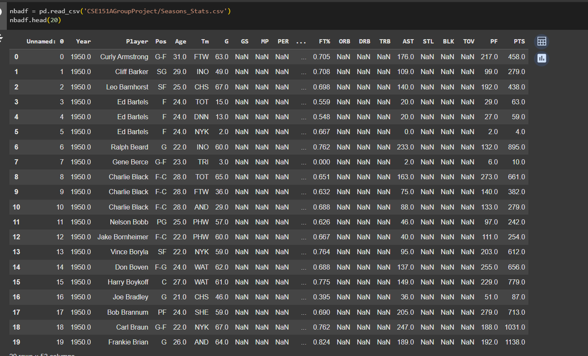
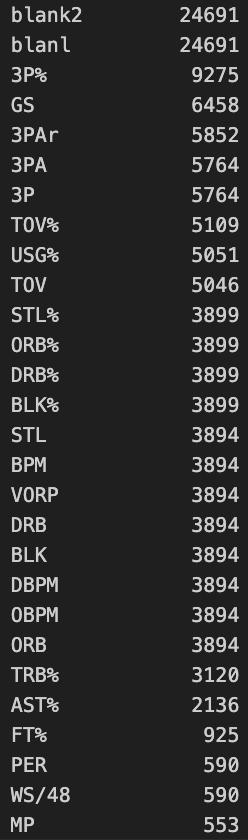
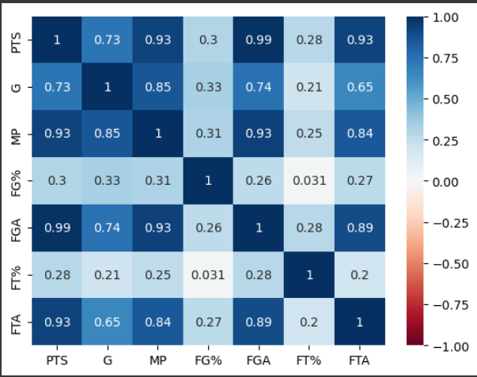
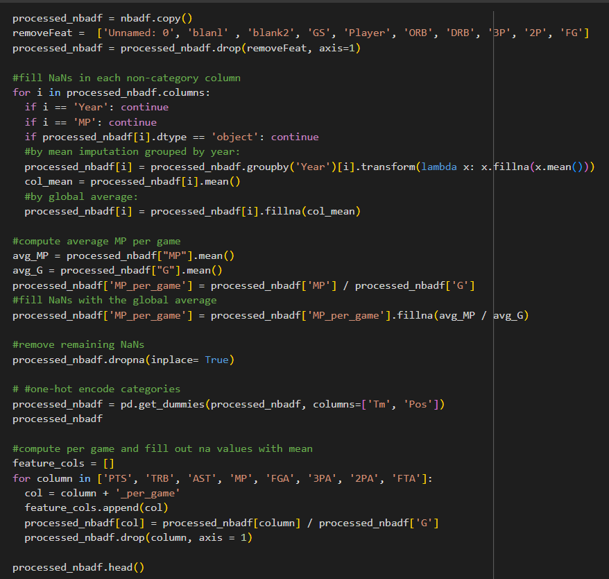
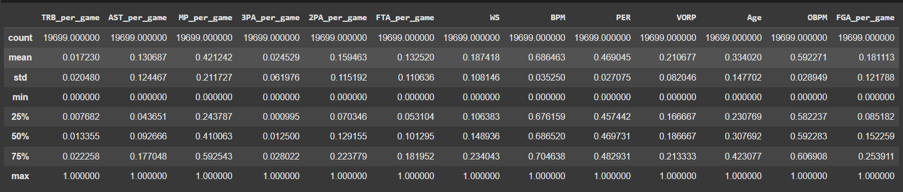
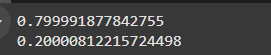

# Predicting Points Per Game (PPG) Using NBA Performance Metrics

*Originally a final assignment for CSE151A at the University of California, San Diego*

## 1. Introduction

Our project focuses on developing a supervised learning model designed to predict the **Points Per Game (PPG)** statistic in the NBA based on a range of other tracked performance metrics. By making use of a **polynomial regression model**, we analyzed the following features:

#### Per-Game Stats:
- Total Rebounds (TRB)
- Assists (AST)
- Minutes Played (MP)
- Field Goals Attempted (FGA)
- Three-Point Attempts (3PA)
- Two-Point Attempts (2PA)
- Free Throws Attempted (FTA)

#### Advanced Metrics:
- Win Shares (WS)
- Box Plus-Minus (BPM)
- Player Efficiency Rating (PER)
- Value Over Replacement Player (VORP)
- Offensive Box Plus-Minus (OBPM)
- Offensive Win Shares (OWS)

The [dataset](data/seasons_stats.csv) we used contained information collected from the 1950s on **24,000 NBA player seasons**, providing a good sample size to shape our model to.

## Key Insights
This model aims to predict PPG by incorporating features that are less prone to early-season/bad shooting stretch variance which. It can account for temporary slumps (e.g., in shooting efficiency) and project a player's **overall scoring trajectory** for the season with greater stability.

## Real-World Applications
- **Betting Predictions:** Accurate PPG forecasts can inform predictive models for betting markets, enhancing decision-making in wagering scenarios.
- **Performance Evaluation:** NBA analysts and teams could use this tool to estimate a player's potential for accolades like **Most Valuable Player (MVP)** considering the importance of scoring in such an award.


# 2. Methods
## Data Exploration
Main data exploration tools used were from numPy and Pandas libraries.
- **Importing our data:** our data came in the form of an csv. We stored the file in our GitHub Repository and read it using:
  
 ```nbadf = pd.read_csv('CSE151AGroupProject/seasons_stats.csv')```

 - **Understanding Our Data**  
   - **Getting a baseline:** we executed several lines of code in order to understand our data better
     - **Discovering features**  ```nbadf.dtypes```
     - **Looking into our Categorical Features**: 
       - ```#for positions print(nbadf.Pos.unique())```
     - **Accessing Distribution:** ```nbadf.describe()```
     - **Counting Mean:** ```nbadf.isnull().sum()```


## Data Exploration Results
We first want to get a sense of how our dataset is like in terms of the values - the data type and number of null values. From looking at the first 20 values of our data, we see early NBA did not keep track of all statistics like they do now. As such we needed to consider how many null values we have in the dataset.

<div style="text-align: center;">
<small><i>Figure 1.1: First 20 rows of the dataframe</i></small>
</div>

<br/>

**Null Values**
We count the number of null values for each attribute. This gives us an idea of what features are good to include into our model and how we should tackle the null values. We notice that `blanl` and `blank2` have the most missing values of greater than 20,000. There were also significant missing values in the Percentage of 3-Point Field Goal Percentage (`3P%`) of more than 9,000, followed by 3-Point Field Goals Attempted (`3PAr`), Games Started (`GS`), Team's Turnovers (`TOV`) and Usage Rate (`USG`) at about 5,000 data points each.


<div style="text-align: center;">
<small><i>Figure 1.2: Top 28 Attributes with Null Values </i></small>
</div>
<br/>

**Pair Plot**
To get a basic relation of our target (`PTS`) and other features we did a simple plot against each other and found a couple of recognizable patterns(normal, linear) using this code:
 ```python
 columns = ['PTS', 'G', 'MP', 'FG%', 'FGA', 'FT%', 'FTA','BPM','WS','VORP']

# Create a PairGrid with 'PTS' as the y-axis for all other features
g = sns.PairGrid(nbadf, y_vars=['PTS'], x_vars=columns[1:])  # Exclude 'PTS' from x_vars
g.map(sns.scatterplot)  # Use scatter plots for visualization

# Adjust layout and display
g.fig.suptitle("Pairplot: PTS (y-axis) vs Other Features (x-axis)", y=1.02)
plt.show()
```
 From the pairplot, we can see that Points (`PTS`) is generally normally distributed. We also observe a strong linear relationship between Points (`PTS`) and Field Goals Attempted (`FGA`), and Points (`PTS`) and Free Throws Attempted (`FTA`).


<div style="text-align: center;">
<small><i>Figure 1.3: Pair plot of Features</i></small>
</div>
<br/>

**Correlation Heatmap**
We also wanted to identify the any correlation between our features and our target variable. We do so by using a Correlation heatmap to be able to look at the relationship at a glance:

```python
# Calculate the correlation matrix
corr = processed_nbadf[['PTS_per_game','TRB_per_game', 'AST_per_game', 'MP_per_game', '3PA_per_game', '2PA_per_game', 'FTA_per_game','WS','BPM', 'PER','VORP','OBPM','Age', 'FGA_per_game']].corr()
# Set up the figure size
plt.figure(figsize=(12, 8))  # Adjust the width (12) and height (8) as needed

# Plot the heatmap
sns.heatmap(corr, vmin=-1, vmax=1, center=0, annot=True, cmap='RdBu')
plt.title("Correlation Heatmap", fontsize=16)

# Show the plot
plt.show()
```


 The strongest correlations were between: Field Goals Attempted (`FGA`) and Points (`PTS`) at 0.99, followed by Minutes Played (`MP`) and Points (`PTS`), and Minutes Played (`MP`) and Field Goals Attempted (`FGA`) at 0.93.
<div style="text-align: center;">
    
</div>
<div style="text-align: center;">
<small><i>Figure 1.4: Correlation heatmap of dataset attributes</i></small>
</div>

     
## Preproccessing

### Steps Included:

<div style="text-align: center;">
<small><i>Figure 1.5: Preprocessing Code</i></small>
</div>

1. **Removing Unwanted/Invalid Features:**
   - Removed features containing unusable data: `Unnamed: 0`, `blanl`, `blank2`.
   - Excluded features deemed unnecessary: `GS`, `Player`.
   - Dropped features that would not generalize well or were too constricting for predictions: `ORB`, `DRB`, `3P`, `2P`, and `FG`,`.
   - See corresponding code in **Lines 2-3**.

2. **Imputing Null Data:**
   - Imputed missing values for numerical columns by:
     - Grouping by `Year` and filling with the mean for years close to each other.
     - Filling any remaining missing values using the global average.
   - Specifically computed and filled `MP_per_game` based on the ratio of average `MP` to `G`.
   - See corresponding code in **Lines 5-16 and Lines 18-22**.

3. **Removing Remaining NaNs:**
   - Dropped rows containing any remaining null values after imputation.
   - See corresponding code in **Line 24**.

4. **One-Hot Encoding Categorical Data:**
   - Applied one-hot encoding to categorical features: `Tm` (Team) and `Pos` (Position).
   - See corresponding code in **Line 26**.

5. **Feature Engineering: Filtering Features to Per Game Statistics:**
   - combined 2 related features `ORB` and `DRB` into `TRB`
   - Converted raw features like `PTS`, `TRB`, `AST`, etc., into per-game statistics by dividing by the number of games (`G`).
   - Removed the original columns after computing the per-game values.
   - See corresponding code in **Lines 28-36**.

6. **Splitting and Normalization**-
   - Splitting our data into training and testing section with SKlearn train_test_split into a 80:20 ratio.
```python
from sklearn.model_selection import train_test_split

X_train, X_test, y_train, y_test = train_test_split(processed_nbadf[['Desired Features']], processed_nbadf.PTS_per_game, test_size=0.2, random_state=21)
```

  - Normalization of our data through sklearn MinMaxScaler
  ```python
from sklearn.preprocessing import MinMaxScaler,
scaler = MinMaxScaler()
X_train_scaled = scaler.fit_transform(X_train)
X_test_scaled = scaler.transform(X_test)

X_train = pd.DataFrame(X_train_scaled, columns=X_train.columns, index=X_train.index)
X_test = pd.DataFrame(X_test_scaled, columns=X_test.columns, index=X_test.index)
```

---
## Model 1
We started by implementing a simple LinearRegression from SKlearn implementation of LinearRegression over the following `TRB_per_game`, `AST_per_game`, `MP_per_game`, `3PA_per_game`, `2PA_per_game`, `FTA_per_game`,`Age`, and `OBPM`

```python
from sklearn.linear_model import LinearRegression
from sklearn.metrics import mean_squared_error
``` 
Creation of the model
```python
  linearreg = LinearRegression()
  linearmodel = linearreg.fit(X_train, y_train)
```

Testing MSE for our model
```python
yhat_test = linearreg.predict(X_test)
yhat_train = linearreg.predict(X_train)
testMSE = mean_squared_error(y_test, yhat_test)
trainMSe = mean_squared_error(y_train, yhat_train)
```
Our model was created and fit to our train data and subsequently tested on our test data.

## Model 2
For this second model, we made use of the same processed data with following features:
`TRB_per_game`, `AST_per_game`, `MP_per_game`, `3PA_per_game`, `2PA_per_game`, `FTA_per_game`, `WS`, `BPM`, `PER`, `VORP`, and `Age`

For this model, we also included `WS`, `BPM`, `PER` and `VORP`.

Our second model was trained using polynomial regression and we made use of Sklearn's Polynomial Features.
```python
from sklearn.preprocessing import PolynomialFeatures
```
To identify the best degree of polynomial for our features, we iterated over different degrees to tune our degree parameter to be a best fit for our model (where degree = 3 performed the best) which was found using code below:
```python
degrees = [1,2,3,4]
for degree in degrees:
  initialDegree = degree
  poly = PolynomialFeatures(degree=initialDegree)
  X_train_poly = poly.fit_transform(X_train)
  X_test_poly = poly.transform(X_test)

  model2 = LinearRegression()
  model2.fit(X_train_poly, y_train)
  y_train_pred = model2.predict(X_train_poly)
  y_test_pred = model2.predict(X_test_poly)


  train_mse = mean_squared_error(y_train, y_train_pred)
  test_mse = mean_squared_error(y_test, y_test_pred)
  train_mse_list.append(train_mse)
  test_mse_list.append(test_mse)

  print(f"Polynomial Regression (Degree={initialDegree})")
  print(f"Train MSE: {train_mse:.2f}")
  print(f"Test MSE: {test_mse:.2f}")
  ```
We then adjusted our model using the best degree that we had found as such:
```python 
poly = PolynomialFeatures(degree=3)
X_train_poly = poly.fit_transform(X_train)
X_test_poly = poly.transform(X_test)
model2 = LinearRegression()
model2.fit(X_train_poly, y_train)
y_test_pred = model2.predict(X_test_poly)
```

To see the accuracy of our models predictions we compared ŷ to y (`ppg`) to score differential between prediction and reality
``` python
newY = y_test - y_test_pred
# Define thresholds
thresholds = [0.5, 1, 2.5, 5]

# Calculate residuals
newY = y_test - y_test_pred

# Calculate FNFP (total values not within ±0.5)
correct = len(newY[abs(newY) < 0.5])
FNFP = len(y_test) - correct

# Count how many FNFP are within each threshold range
fnfp_within_ranges = [
    len(newY[(abs(newY) > thresholds[i]) & (abs(newY) <= thresholds[i + 1])])
    for i in range(len(thresholds) - 1)
]

# Print results
print(f"Correct Values: {correct}")
print(f"FNFP Values: {FNFP}")
for i in range(len(thresholds) - 1):
    print(f"FNFP between {thresholds[i]} and {thresholds[i+1]}: {fnfp_within_ranges[i]}")
```

To do more analysis on whether our model was overfitting/underfitting used SKlearn Cross validation score
```python
from sklearn.model_selection import cross_val_score
from sklearn.model_selection import KFold
kf = KFold(n_splits=10, shuffle=True)
cv_scores = cross_val_score(model2, X_train_poly, y_train, cv=kf, scoring='neg_mean_squared_error')
print('Cross-Validation Scores:', -cv_scores)
```


## Model 3
In our third model, we decided to group the `PPG` into 4 different category and use the bins as our output instead.

<div style="text-align: center;">
<small><i>Figure 1.6: Table showing the different bins</i></small>
</div>

We create a new column in the dataframe with the following code:

```python
bins = {"Low": desc["PTS_per_game"]["25%"], "Medium": desc["PTS_per_game"]["50%"], "High": desc["PTS_per_game"]["75%"]}
print(bins)
nbadf_2 = processed_nbadf.copy()

#Convert keys into numeric vals, Very High = 3
def PPG_binner(value):
    if value < bins['Low']:
        return 0
    elif value < bins['Medium']:
        return 1
    elif value < bins['High']:
        return 2
    else:
        return 3

#Apply the function to PTS_per_game
nbadf_2['PPG_Bins'] = nbadf_2['PTS_per_game'].apply(PPG_binner)
nbadf_2 = nbadf_2.drop("PTS_per_game", axis=1)

```

We will then perform PCA using the same features as our previous model.
``` python
from sklearn.decomposition import PCA

pca = PCA()
pca.fit(X_train)

# Scree plot
plt.figure(figsize=(10, 6))
plt.plot(range(1, len(ev) + 1), ev, marker='o', linestyle='--')
plt.title('Scree Plot')
plt.xlabel('n_components')
plt.ylabel('Explained Variance Ratio')
plt.xticks(np.arange(1, len(ev) + 1, 1))
plt.grid()
plt.show()
```

We also plot the Cumulative Explained Variance to be able to identify the best number of components and the variance explained.
``` python
cumulative_variance = np.cumsum(ev)
plt.figure(figsize=(10, 6))
plt.plot(range(1, len(cumulative_variance) + 1), cumulative_variance, marker='o', linestyle='--')
plt.title('Cumulative Explained Variance Plot')
plt.xlabel('n_components')
plt.ylabel('Cumulative Explained Variance')
plt.xticks(np.arange(1, len(cumulative_variance) + 1, 1))
plt.grid()
plt.axhline(y=0.90, color='r', linestyle='--')  # threshold at 90%
plt.show()
```


From our PCA and Cumulative Explained Variance plot, we will identify the best number of components to use (in this case would be 3). 

Firstly we will create a PCA with 3 components and identify the feature with the highest positive weight.
```python
pca = PCA(n_components= 3)
pca_df = pd.DataFrame(pca.fit_transform(X_train))
pca_df['Labels'] = nbadf_2.PPG_Bins

plt.figure()
plt.scatter(pca_df[0], pca_df[1],
            c=pca_df['Labels'],
            alpha=0.6)
plt.title('PCA Clusters')
plt.xlabel('PCA1')
plt.ylabel('PCA2')
plt.colorbar(label='Cluster Label')
plt.grid()
plt.show()


feature = 0
hi_feat = -1
hi_weight = -1
for i in pca.components_[0]:
    if i > hi_weight and i > 0:
        hi_feat = feature
        hi_weight = i
    feature += 1

print('Feature with the highest positive weight:')
print(hi_feat, hi_weight)
```

We will use SVD to transform our features and will fit a logistical regression for this model.
```python
from sklearn.decomposition import TruncatedSVD

svd = TruncatedSVD(n_components=3, n_iter=1000, random_state=76)
svd.fit(X_train)
sv = svd.singular_values_

right_matrix = pd.DataFrame(svd.components_)
right_matrix.shape # lets check the shape

left_matrix = pd.DataFrame(svd.fit_transform(X_train))/ sv
left_matrix.shape
```
``` python
from sklearn.linear_model import LogisticRegression
from sklearn.metrics import classification_report, accuracy_score

# Step 1: Transform both training and testing data using SVD
X_train_svd = pd.DataFrame(svd.transform(X_train), index=X_train.index)
X_test_svd = pd.DataFrame(svd.transform(X_test), index=X_test.index)

# Step 2: Fit a classifier on the transformed training data
classifier = LogisticRegression()
classifier.fit(X_train_svd, y_train)

# Step 3: Predict on the transformed test data
y_pred = classifier.predict(X_test_svd)

# Evaluate the model
print("Accuracy:", accuracy_score(y_test, y_pred))
print("\nClassification Report:\n", classification_report(y_test, y_pred))


y_pred2 = classifier.predict(X_train_svd)

print("Accuracy:", accuracy_score(y_train, y_pred2))
print("\nClassification Report:\n", classification_report(y_train, y_pred2))
```


## Model 4
For our final model, an artificial neural network will be used to classify <code>PPG_bins</code> based on our previous per_game variables. We will run our models to predict <code>10 bins</code>, binned by the datset's deciles. This change better reflects our model's classification strength as well as the transition from regression to classification, as the bins and our predictions are closer in resemblance to our regression model.

Similar to model 3, we create a new column with our 10 classes:

```python
quants = processed_nbadf["PTS_per_game"].quantile(q= [.1,.2,.3,.4,.5,.6,.7,.8,.9,1])
bins = {x:quants[x] for x in quants.keys()}
nbadf_3 = processed_nbadf.copy()

def PPG_binner(value):
    count = 0
    key = 0.1
    while count < 9:
        if value < bins[key]:
            return count
        count += 1
        key += 0.1
        key = np.round(key, 2)
    return count

#Apply the function to PTS_per_game
nbadf_3['PPG_Bins'] = nbadf_3['PTS_per_game'].apply(PPG_binner)
nbadf_3 = nbadf_3.drop("PTS_per_game", axis=1)

```

Then the data is split into training and test sets, both of which are normalized individually:

```python
#Split the training and test data, then normalize
X_train, X_test, y_train, y_test = train_test_split(
    nbadf_3.iloc[:, -7:-1], 
    nbadf_3.PPG_Bins, 
    test_size=0.2, 
    random_state=21)

scaler = MinMaxScaler()
X_train_scaled = scaler.fit_transform(X_train)
X_test_scaled = scaler.transform(X_test)

X_train = pd.DataFrame(X_train_scaled, columns=X_train.columns, index=X_train.index)
X_test = pd.DataFrame(X_test_scaled, columns=X_test.columns, index=X_test.index)

```

Since our model uses 7 features to predict one of 10 classes, Our ANN will start with an input layer of size 7. Then, three hidden layers are added as follow:

* Layer 1: 64 nodes using <code>relu</code> activation.
* Layer 2: 32 nodes using <code>relu</code> activation.
* Layer 3: 12 nodes using <code>relu</code> activation.

Hyperparameter tuning was performed outside of this notebook. relu activation was chosen as our feature variables are quantitative continuous.\
Our final output layer contains 10 nodes in accordance to our 10 categories, using <code>softmax</code> activation. Softmax is the preferred activation for milti-class classification.

Our learning rate was also fine-tuned outside of this notebook. Using Adam and a learning rate of 0.001, our model's loss was minimized using <code>sparse_categorical_crossentropy</code>, as our y values were numeric. Our model was evaluated using accuracy.

```python
X = nbadf_3.iloc[:, -7:-1]
def mdl():
    model = Sequential([
        Input(shape=(X.shape[1],)),
        Dense(64, activation= 'relu'),
        Dense(32, activation= 'relu'),
        Dense(12, activation= 'relu'),
        Dropout(0.5),
        Dense(10, activation= 'softmax')])
    adam = Adam(learning_rate=0.001)
    model.compile(optimizer= adam, loss= 'sparse_categorical_crossentropy', metrics= ['accuracy'])
    return model

def ravel(cm):
    num_classes = cm.shape[0]
    tp = np.zeros(num_classes)
    fp = np.zeros(num_classes)
    fn = np.zeros(num_classes)
    tn = np.zeros(num_classes)
    total_instances = np.sum(cm)
    for i in range(num_classes):
        tp[i] = cm[i, i]
        fp[i] = np.sum(cm[:, i]) - tp[i]
        fn[i] = np.sum(cm[i, :]) - tp[i]
        tn[i] = total_instances - (tp[i] + fp[i] + fn[i])   
    return tp, fp, tn, fn

estimator = KerasClassifier(model= mdl, epochs= 100, batch_size= 1000, verbose= 0)
estimator.fit(X_train, y_train)
y_pred = estimator.predict(X_test)

```

Due to the nature of hyperparameter tuning and its heavy usage of time and computational power, hyperparameters were chosen after running code outside of our main notebook.


# 3. Results

## Data Preprocessing
After all prepocessing was finished, our new dataframe ends up looking like: 

<div style="text-align: center;">
<small><i>Figure 2.1: Processed dataframe</i></small>
</div>


The number of null values have become zero as desired as well:


<div style="text-align: center;">
<small><i>Figure 2.2: Number of null values for each feature</i></small>
</div>


Check that our X train and X test are normalized and sizes are looking right:

<div style="text-align: center;">
    
</div>
<div style="text-align: center;">
<small><i>Figure 2.3: XTrainScaled Table</i></small>
</div>

<div style="text-align: center;">
    
</div>
<div style="text-align: center;">
<small><i>Figure 2.4: XTestScaled Table</i></small>
</div>


We output the proportion of data points in our X_train and X_test below:
<div style="text-align: center;">
    
</div>
<div style="text-align: center;">
  <small><i>Figure 2.5: proportions of X_train and X_test respectively</i></small><br>
</div>

## Model 1
**Running Model 1**: 
- Our first output for our Linear regression model outputted as:
```python
Training MSE: 0.52
Testing MSE: 0.50
```

To find out why MSE was so low we plotted this correlation matrix.

<div style="text-align: center;">
  <small><i>Figure 2.6: Correlation matrix of features</i></small>
</div>


Running Linear model without `FGA_per_game` results in:

 
```python
Training MSE for no FGA: 1.65
Testing MSE for no FGA: 1.59
```
 
 We then check for overfitting using Kfold Cross validation for first run of model, with the following results:
```python
Cross-Validation Scores: [0.46139252 0.48908755 0.5362284  0.48781997 0.54074659 0.49958713
 0.50085788 0.52959658 0.53930553 0.60954084]
```

## Model 2

After implementation of our second model we printed out the MSE between the training and testing as well as their differences against degree (complexity).
```python
Polynomial Regression (Degree=1)
Train MSE: 1.65
Test MSE: 1.59
Polynomial Regression (Degree=2)
Train MSE: 0.54
Test MSE: 0.57
Polynomial Regression (Degree=3)
Train MSE: 0.34
Test MSE: 0.44
Polynomial Regression (Degree=4)
Train MSE: 0.21
Test MSE: 88.83
```

We observe that the elbow of the fitting graph lies when the polynomial degree is 3.


<div style="text-align: center;">
  <small><i>Figure 2.7: Fitting Graph all 4 degrees</i></small>
</div>


<div style="text-align: center;">
  <small><i>Figure 2.8: Fitting Graph 3 degrees</i></small>
</div>


Checking for overfitting based on KFold Cross Validation we got: 
``` python
Cross-Validation Scores (MSE): [ 0.43217879  0.46648901  0.43258806  0.57135784  0.39732678  0.51268138
  0.67144083 14.51494587  0.82262654  0.52637149]
```

### Checking Accuracy
By checking the point differential we concluded our model was able to predict the following metrics:
```python
Accuracy = 0.69198
Correct Values: 3408
FNFP Values: 1517
FNFP between 0.5 and 1: 1055
FNFP between 1 and 2.5: 432
FNFP between 2.5 and 5: 25
FNFP between 5 and 10: 5
```

Considering the range of points typically is between 6 to 27, 
we classified as followed:


- Between .5 and 1: marginally small/ignorable
- Between 1 and 2.5 as :meaningful error
- anything > 2.5 as critical

Definitively classifiable as Correct: Correct: 69.20%

Allowable Correctness : 90.62%


## Model 3

We plot the following scree plot and cumulative explained variance plot to identify the number of components to retain in our model.


<div style="text-align: center;">
  <small><i>Figure 2.9: Screeplot generated from PCA</i></small>
</div>


<div style="text-align: center;">
  <small><i>Figure 2.10: Plot of Cumulative Explained Variance</i></small>
</div>


From the above plots, we identified n_components=3 to be the best number of components as the curve starts to flatten out beyond that point.


We plotted a PCA cluster plot to be able to identify the clustering. 


<div style="text-align: center;">
  <small><i>Figure 2.11: Plot of PCA clusters</i></small>
</div>


We also used SVD to fit the 3 components. This is the visualisation of our SVD in the form of a pairplot, showing each of the 3 components of the left and right matrices that we have created.


<div style="text-align: center;">
  <small><i>Figure 2.12: Pairplot of left matrix</i></small>
</div>


<div style="text-align: center;">
  <small><i>Figure 2.13: Pairplot of right matrix</i></small>
</div>

We implemented a logistic regression for our third model using the transformed SVD as inputs. 

These are the output when we ran our train and test values:

<div style="text-align: center;">
  <small><i>Figure 2.14: Accuracy and Classification Report for Train</i></small>
</div>


<div style="text-align: center;">
  <small><i>Figure 2.15: Accuracy and Classification Report for Test</i></small>
</div>


## Model 4

To analyze our models performance, a confusion matrix is used as well as the model's accuracy. To properly understand the results, the MSE, precision, recall, and the raveled confusion matrix are printed for further details:

```python
cm = confusion_matrix(y_test, y_pred)
acc = accuracy_score(y_test, y_pred)
mse = mean_squared_error(y_test, y_pred)
prec = precision_score(y_test, y_pred, average= None, zero_division= 0)
rec = recall_score(y_test, y_pred, average= None)

tp, fp, tn, fn = ravel(cm)

# Print the results
print("Confusion Matrix:\n", cm)
print("Accuracy:", acc)
print("Mean Squared Error:", mse)
print("True Positives: ", tp)
print("False Positives: ", fp)
print("True Negatives: ", tn)
print("False Negatives: ", fn)
print("Precision for each class:", prec)
print("Recall for each class:", rec)
```


<div style="text-align: center;">
  <small><i>Figure 2.16: Results of Model 4 KerasClassifier</i></small>
</div>

Our model has generated a 10-class predictor with 71% accuracy. To Validate our model's performance, we performed K-fold cross validation to determine if our model's accuracy remained consistent.

```python
cv = RepeatedKFold(n_splits= 10, n_repeats= 1)
acc_scores = []

# Perform cross-validation
for t_idx, v_idx in cv.split(X_train):
    X_train_cv, X_valid = X_train.iloc[t_idx], X_train.iloc[v_idx]
    y_train_cv, y_valid = y_train.iloc[t_idx], y_train.iloc[v_idx]
    
    estimator = KerasClassifier(model= mdl, 
                                epochs= 100, 
                                batch_size= 1000, 
                                verbose= 0)
    estimator.fit(X_train_cv, y_train_cv)
    y_pred = estimator.predict(X_valid)
    acc = accuracy_score(y_valid, y_pred)
    acc_scores.append(acc)
    print(f'Fold accuracy: {acc:.4f}')

# Calculate and print overall average accuracy
average_accuracy = np.mean(acc_scores)
print(f'Overall average accuracy: {average_accuracy:.4f}')

```


<div style="text-align: center;">
  <small><i>Figure 2.17: Results of Model 4 10-fold CrossValidation</i></small>
</div>


# 4. Discussion

## Data Exploration
**Important Observations**
- The 67 seasons missing for `Year`, `Player`,... etc. we reasoned to be droppable because they make up such a small percentage of the poplulation.
- Early on, (1st Milestone) we recognized that older data had to be imputed because certain stats were just not tracked.
- After plotting and seeing figure1, the vaguely linear relationships seen made us want to go with linear regression as our first model to test the grounds.
- Analysis of model 3 shows that among the 5 main positions (Shooting Guard, Center, Point Guard, Small Forward, Power Forward), The distribution of <code>PPG_Bins</code> remained fairly balanced. Each position had players scoring on the lower quartiles and high quartiles, resulting in a PCA graph that did not properly separate players into clusters.
  

## Data Preprocessing  
**Rationale Behind Each Step**  

#### **Feature Removal**  
- **`Unnamed: 0`, `blanl`, `blank2`:** These columns were entirely null and provided no useful information, so they were removed to clean the dataset.  
- **`GS`, `Player`:**  
  - `Player`: We determined that the player's name would not serve as a reliable predictor for statistical performance, and one-hot encoding it would explode our dimension size.  
  - `GS`: This feature was redundant as it correlated closely with `MP` (minutes played). Starters who start games generally accumulate higher minutes, making `GS` unnecessary.  
- **`ORB`, `DRB`**: removed because together they make up `TRB`
-  **`3P`, `2P`, and `FG`:** These features were removed as they are direct contributors to the target variables (e.g., Points Per Game). Including them would risk introducing bias and redundancy in the model.  

#### **Handling Missing Data**  
- **Grouped Imputation by Year:** Missing values were imputed by grouping data based on the year to account for changes in statistical trends across different eras of basketball. This approach helped maintain the integrity of historical differences in player performances.  
  - **Challenge Noted:** Most missing data were clustered in earlier years, which may have introduced bias due to the lack of diverse data representation in those eras.  
- **Global Average for `MPG`:**  
  - The global average was used to impute missing values for `MPG` (Minutes Per Game). Unlike other per-game statistics, `MPG` had a significantly higher proportion of missing values. Filling these gaps using year-specific averages resulted in impossible values (e.g., minutes exceeding a game's total duration). Hence, the global average was deemed more reliable for consistency.
- **Ensure excluding NaN** This step was done to make sure we aren't getting any null values in our data, and we determined the loss of observations is negligble compared to the size of our dataset


## Model 1

#### **Results and Configuration of Model**
- **Initial Results**:  
  Our initial model yielded surprisingly low Mean Squared Error (MSE) values:  
  ```python
  Training MSE: 0.52
  Testing MSE: 0.50
  ```  
  Initially, we selected a linear model as a low-complexity baseline, anticipating signs of underfitting. However, the low training and testing MSE scores did not support this assumption.

- **Cross-Validation Stability**:  
  The consistent Cross-Validation scores from the result section further confirmed that our model was not overfitting. 
  
  The coefficients of the model revealed the following:  
  ```python
  Coefficients: [-4.2614373  -1.42741702  0.23164253 -0.79862453 -7.9158575  10.2326818
   6.30703504 -4.92944255 10.39803628  0.54434877  0.08297025  8.85255046
   42.98666333]
  ```  

- **Observation on Feature Correlations**:  
  After examining the feature correlation matrix, we identified a strong correlation between `PPG` (Points Per Game) and `FGA` (Field Goal Attempts). Furthermore, the coefficients indicated that `FGA` was dominating the model, overshadowing other features. Since `FGA` is y a combination of `3PA` (3-Point Attempts) and `2PA` (2-Point Attempts), we decided to exclude `FGA`.

- **Updated Model Performance**:  
  After removing `FGA` from the model, the MSE values increased significantly:  
  ```python
  Training MSE (No FGA): 1.65
  Testing MSE (No FGA): 1.59
  ```  
  This increase in error for both the training and testing datasets indicates that the initial model was likely overfitting, heavily relying on `FGA` to minimize error without generalizing well.

- **Final Thoughts on FGA Exclusion**:  
  Removing `FGA` has helped reduce overfitting and allowed other features in the model to play a more balanced role. While the overall MSE increased, the model is now less reliant on a single dominating feature


## Model 2
- **Initial Thoughts**:  
  Based on our findings from Model 1, we decided to exclude `FGA_per_game` from this model due to its dominating influence in the previous results. 

- **Initial Hyperparameter Tuning**:  
  To find the optimal balance between complexity and error minimization, we tuned the degree of the polynomial terms. We identified that a polynomial of degree 3 provided the best performance for our dataset.  
  - **Degrees 1 and 2**: Training and testing errors were too close, indicating underfitting.  
  - **Degree 3**: This degree achieved the right mix of complexity and accuracy, minimizing errors while maintaining generalizability.

- **Model Performance on the Fitting Graph**:  
  The model passed the "eye test" when evaluating the MSE against polynomial degrees (complexity). Using K-fold cross-validation, we observed that while the MSE stayed below 1 for most iterations, one iteration experienced a significant error spike (MSE = 14), indicating our model is overfitting.

- **Calculating Correctness**:  
  Although this is a regression problem, we evaluated the model's performance by classifying predictions into "correct" or "incorrect."  
  - A difference of **0 to 0.5 PPG (points per game)** for a season is considered negligible. Using this criterion, the model achieved an accuracy of **69.20%** for definitive correctness.  
  - Extending this range to **0 to 1 PPG** due to the naturally high variance in PPG scores, the model's correctness increases to **90.62%**, which is considered excellent.  
  - However, the spike observed during K-fold cross-validation suggests that this accuracy may degrade on specific, small subsets of NBA seasons, where the model struggles to generalize.

- **Final Notes**:  
  The results of Model 2 demonstrate significant improvement in generalization compared to Model 1. While the high correctness scores are promising, further refinement is necessary to address the overfitting observed in certain cross-validation subsets.


## Model 3
- **Initial Thoughts**: 
  We feel that separating `PPG` into bins could yield better performance in our model in terms of accuracy, since the classification task simplifies the prediction process to determine the correct range (bin) rather than the exact numerical score. The bins are also a good indicator of how well a player is performing relative to their peers and provide a more interpretable output for assessing performance tiers.

- **Initial Hyperparameter Tuning**:  
  For this model, we tested dimensionality reduction techniques like PCA (Principal Component Analysis) and SVD (Singular Value Decomposition) to reduce the number of features while retaining the variance or meaningful components. We experimented with the following parameters:
  - **PCA**: Tuned the number of principal components (n_components) between 1 and 4 to find an optimal balance between model simplicity and information retention.
  - **SVD**: Tested truncation levels to determine the number of singular vectors to retain. Optimal values were found when keeping 90% of the cumulative explained variance.
  - **Logistic Regression**: Explored variations in the regularization parameter (C) and penalty terms (l1 and l2) to prevent overfitting while maximizing predictive accuracy.


  Through the PCA analysis, we found that it performs best when using 3 components (through looking at the figures 2.9 and 2.10). However, when plotting the PCA clusters, we see a very poor clustering for the following few reasons:
  - The PCA plot exhibited a wedge-like shape, which can be traced back to the absence of negative values in the dataset. PCA assumes that the data is centered around the origin and utilizes both positive and negative feature values to form clusters. In our case, the lack of negative values limited the spread of data points along the principal components, compressing the clusters into a skewed, one-sided distribution. This shape makes it harder to distinguish meaningful groupings in the reduced feature space.
  - Standarization was performed prior to the fitting of the PCA. The standardization may have inadvertently distorted the inherent relationships between the features, especially if some features were more informative in their raw state. This distortion could have hindered PCA's ability to accurately represent the underlying structure of the data, resulting in less effective clustering. 

  We will then use SVD to address these shortcomings to reduce dimensionality as it is effective for non-negative data, it is aloso efficient in preserving feature relationships and it is compatible with sparse data.

- **Model Performance**: 
  After applying SVD, we plotted the training and validation accuracies across the logistic regression model's epochs. The fitting graph indicated that dimensionality reduction significantly stabilized the learning curve, reducing overfitting compared to the baseline logistic regression model. Training accuracy hovered around 92%, while validation accuracy reached 88%, showing a small generalization gap. The model performed well across most bins, though performance slightly decreased in underrepresented bins.

  After plotting the transformed feature matrix obtained through SVD, we gained deeper insights into why our PCA approach failed to produce well-defined clusters:

  - **Unimodal Distribution**: The vertical plots for n=2 and n=3 exhibit a predominantly unimodal distribution. This lack of multiple peaks indicates that our data does not naturally form distinct clusters. If the data had shown multiple peaks or clear separations, clustering would have been more discernible and effective.
  - **Redundancy in Information**: The right matrix (with fewer observations) provides very little significant information that the left matrix does not already convey. This redundancy suggests that most of the meaningful patterns in the data are captured by the initial components, limiting the additional benefits of higher components.

  With this understanding, we move forward by leveraging the transformed training data to perform logistic regression and fitted the regressor to the transformed training set.

- **Calculating Correctness**:  
  The performance of the model on the test set was evaluated using the classification report, which provides detailed insights into precision, recall, F1-score, and support for each class. The model achieved an overall accuracy of 84% across the test set, which is a strong result given the complexity of predicting binned categories. 
  - **Macro Average**: Both precision, recall, and F1-score are 0.84, indicating balanced performance across all classes. This shows the model does not disproportionately favor any particular class.
  - **Weighted Average**: The weighted average aligns with the macro average, as the class distribution is relatively even (as seen from the support values). This ensures that the model’s overall performance is not skewed by class imbalance.
  - **Confusion between Classes 1 and 2**: The slightly lower F1-scores for Classes 1 and 2 suggest that there may be some overlap or confusion between these categories. This could stem from inherent similarities in the features of these bins, leading the model to misclassify instances between them.
  - **Strength in Extreme Classes**: The model performs best on Classes 0 and 3, which likely represent the extreme ends of the binned ranges. This suggests that these classes have more distinct feature patterns, making them easier for the model to classify accurately.


- **Final Notes**:
  We see that this model using SVD and logistic regression performed well with a high accuracy of about 84%. This high accuracy suggests that the model generalizes well to unseen data.


## Model 4
- **Initial Thoughts**: 
  Model 4 was influenced for 2 main reasons: validation of Model 3's high accuracy by increasing bin size and the use of a more complex model than the previous 3. By increasing the bin sizes from 4 to 10 a more robust model can be created without depending on logistic regressions safety net of guessing correctly due to being off by a few points. Additionally, an artificial neural network can improve on the basics of logistic regression and SVD classification by fine tuning model parameters while ensuring that over/underfitting is less of a problem.

- **Initial Hyperparameter Tuning**:  
  Due to the computationally heavy nature of <code>keras_tuner</code>. Hyperparameter tuning was done outside of this notebook in a more stable environment. Our 3 hidden layer model was inspired by previous ANNs created for homework 4 of our course. Each hidden layer was tuned using base nodes of 8, incrementing the first and second parameter by 8 until the max node count of 64, for a total of 64 tests. Node 3 was adjusted to 12 due to showing higher performance after fine tuning. Additionally, the learning rate was adjusted between the values of <code>10e-2</code> to <code>10e-6</code>. Since our training variables were quantitative and our predictions were quantitative, there was no need to tune any activation functions, as <code>relu, softmax, and sparse_categorical_crossentropy</code> are the ideal functions for this type of data. An <code>epoch</code> of 100 and a <code>batch_size</code> of 1000 was used to properly sample the data.

- **Model Performance**: 
  After finding the optimal hyperparameters, the model was run and a confusion matrix was generated. Our model shows clear signs of proper predictions, while maintaining a low false positive and false negative rate. out of the 10 categories, 6 showed a higher recall rate and 4 had a higher precision rate. This is favorable, as our model prefers to reduce cases of false negatives.

- **Calculating Correctness**:  
  Model 4's performance was evaluated using the accuracy of the predictions. A baseline model that predicts only one class would have an average accuracy of 10%. our model resulted in an average accuracy of 70%, verifying that our model performs well above our baseline.

```python
train_pred = estimator.predict(X_train)
acc = accuracy_score(y_train, train_pred)
print("Accuracy:", acc)

```


<div style="text-align: center;">
  <small><i>Figure 3.1: Results of KerasClassifier predictions on the training set</i></small>
</div>

In terms of where model 4 stands in our loss curves, our training predictions is slightly less than our test accuracy, although a .6% difference can be interpreted as significant. Due to these factors, our model shows no signs of overfitting or underfitting.

- **Final Notes**:
  Based on each of our model's performance, our ANN model produced surprising results. Increasing our model's classification task from 4 bins to 10 slightly decreased our model's accuracy; however, 10 bins is a significant jump in classification, resulting in a stronger model altogether. Additionally, 2 tests were performed outside of this notebook to compare models 3 and 4.
  1. Model 3 run with 10 bins resulted in an accuracy of 40%
  2. Model 4 run with 4 bins resulted in an accuracy of 90%. The results of these tests show that basic logistic regression from Model 3 is not enough to properly categorize large and complex data such as player stats.


# 5. Conclusion

This analysis highlights the progressive improvements and trade-offs made across the four models in predicting player performance based on key basketball statistics. By leveraging different modeling techniques, feature engineering, dimensionality reduction, and artificial neutal network approaches, we were able to draw several key insights:

## Model 1 (Baseline Linear Regression):

The initial linear regression model, while achieving low MSE scores, relied heavily on a single feature (FGA) to minimize error. This indicated overfitting, as the model failed to generalize well across features.
Removing FGA increased the MSE but enabled the model to balance contributions from other features, resulting in a more interpretable and generalizable model.


## Model 2 (Polynomial Regression):

Introducing polynomial features of degree 3 improved the model's ability to capture non-linear relationships in the data, achieving high correctness rates within acceptable error margins.
Despite promising results, spikes in cross-validation errors exposed challenges with overfitting on certain subsets, indicating the need for further refinement.


## Model 3 (SVD + Logistic Regression):

Transitioning to a classification-based approach by binning PPG into performance tiers simplified the prediction task and improved interpretability.
Dimensionality reduction using SVD addressed the limitations of PCA and stabilized the logistic regression model, leading to a robust accuracy of 84% on the test set.
The confusion matrix and classification report revealed strong performance in the extreme bins, with minor misclassifications in mid-range bins likely due to feature overlap.
Despite strong classification using 4 bins, increasing bin sizes drastically reduces the model's performance.


## Model 4 (ANN + K-fold CV):

Similar to model 3, the transition of a regression approach to a classification model is bridged by performing multi-class logistic regression. The greater the number of classes, the better the results reflect on the model's ability to predict both linear and logistically.
Artificial neural networks using kerasClassification improved on the results of model 3, formulating a more convincing model and argument for correctly classifying player statistics per game.
The confusion matrix and classification report revealed strong performance in bins closest to the correct class, with very few misclassifications in non-adjacent bins.
10-fold Cross-Validation bolstered the models performance, showing that the model can continue to perform well in unseen data.
Accuracy deltas between training and test data show that the model is neither overfit nor underfit, falling precisely on the optimal points in the error curve.


## Final Recommendation
Model 4 stands out as the most effective approach for this problem, striking a balance between accuracy, generalizability, and interpretability. By focusing on classification rather than regression and leveraging dimensionality reduction, the model avoids overfitting while maintaining high performance. Future improvements could involve exploring ensemble methods or fine-tuning hyperparameters further to address the slight misclassification in mid-range bins.

This progression underscores the importance of iterative experimentation, feature engineering, and appropriate evaluation metrics when tackling real-world machine learning problems.


# 6. Statement of Collaborations
Alex Sieh: Conducted preliminary research on the dataset.

Dionne Leow: Contributed to the data cleaning and visualization. Contributed to model 3 description and making final edits of the ReadMe.

Edgar Guzman: Developed model 3, experimenting with PCA and SVDs to improve our model. Developed model 4. Added model 4 and final edits to the ReadMe.

Jonathan Duong: Contributed to data extraction, cleaning, visualisation and preprocessing.

Ryan Chon: In charge of the polynomial model, as well as write up and reasoning. Contributed to every section of final writeup.
